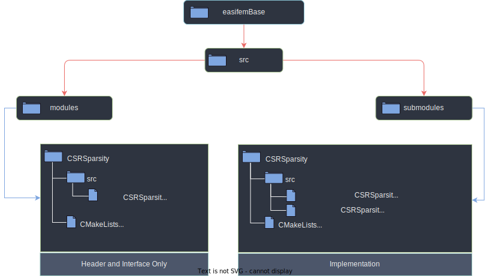

# 𑗕 easifemBase

As the name suggests `easifemBase` (henceforth, read as Base) library is the lowest (or, base) level component in easifem.
It contains a lot of valuable routines and derived types. In Base library, we do not use object-oriented programming concepts and mainly use [multiple dispatch approach](https://en.wikipedia.org/wiki/Multiple_dispatch). This approach improves the flexibility and speed of easifemBase. All user-defined datatypes are declared in the `BaseType` module, and all methods are exposed through `BaseMethods modules.

In the Base library `string_class` is the only exception, wherein Object-oriented paradigm has been used.

Currently, easifemBase has interface with BLAS95, Lapack95, Sparsekit, Metis, PlPlot, SuperLU, ARPACK, etc.

## Usage

### Use association

```fortran
USE easifemBase
```

or

```fortran
USE BaseType
USE BaseMethods
```

## System requirements

EASIFEM requires following software packages to be installed on the system.

| Component | Version | Latest tested version | Comment |
|:--- | :---: | :---: | :--- |
| **Gfortran**| >=9.0 | 12.0  | GNU Fortran compiler |
| **GCC**| >=9.0 | 12.0 | GNU-compiler collection|
| **OpenMP**| >= 4.5 |  | Multithread shared memory parallelisation|
| **Curl**| >=7.87 | 7.87 | A command-line utility for transferring data from or to a remote server|
| **Git**| >=2.34 | 2.34.1 | A version control system and command-line utility for downloading packages from GitHub |
| **Cmake** | >=3.19 | 3.22.4 | Cross-platform family of tools designed to build, test and package software |
| **Ninja-build** | >=1.10 | 1.11.0 | Build system |
| **Python3** | >=3.7 | 3.11.0 | Scripting language |
| **Pip** | >=20 | 23.1.0 | Command line tool for downloading python packages |
| **LAPACK** | >=3.11.0 | 3.11.0 | Linear algebra package |
| **OpenBlas** | >= 0.3.20| 0.3.30 | Optimize BLAS library |
| **HDF5** | >=1.10  | 1.10.7 | High-performance data software-library and file-format |
| **PlPlot** | >=5.15.0 | 5.15.0 | Cross-platform, scientific graphics plotting library |
| **Boost** | | | |
| **Gnuplot** | >=5.0 | 5.4 | Portable command-line driven graphing utility |
| **Doxygen** | >=1.9.1 | 1.9.1 | documentation generation |
| **GTK-4** |  | | n |


## External packages

EASIFEM depends upon the following external packages (extpkgs) that are not shipped with the source-code.

| extpkg| description | command  |
|:--- | :--- | :--- |
| [OpenBlas](https://www.openblas.net/) | Highly optimized BLAS | easifem install openblas |
| [SuperLU](https://github.com/xiaoyeli/superlu.git) |  Direct solution of large, sparse, nonsymmetric systems of linear equations  | easifem install superlu |
| [LIS](https://github.com/anishida/lis.git) | Linear interative solver | easifem install lis|
| [METIS](https://github.com/KarypisLab/METIS) | Mesh partitioning library | easifem install metis |
| [SCOTCH](https://gitlab.inria.fr/scotch/scotch) | Mesh partitioning library | easifem install scotch |
| [ARPACK](https://github.com/opencollab/arpack-ng) | Eigensolver for sparse matrices | easifem install arpack |
| [FFTW](https://www.fftw.org/) | Fast Fourier Transform| easifem install fftw |
| [GTK-Fortran](https://github.com/vmagnin/gtk-fortran) | Fortran bindings for GTK-4 library  | easifem install gtk-fortran |
| [LAPACK95](https://github.com/vickysharma0812/LAPACK95.git) | Fortran 95 interface for Lapack library | easifem install lapack95 |
| [Sparsekit](https://github.com/vickysharma0812/Sparsekit.git) | Fortran library for sparse matrices | easifem install sparsekit |
| [Gmsh](https://gmsh.info/) | Finite element mesh generator| easifem install gmsh |


## Installation

You can use following instructions to install easifemBase depending upon your system.

- [Linux](./pages/Install_Linux.md)
- [MacOSX](./pages/Install_MacOSX.md)
- [Windows](./pages/Install_Windows.md)

## Structure

The Base library consists two components:

1. BaseType `BaseType.F90`, which contains the user-defined data-type. You can see the list of user-defined data type [here](./pages/BaseType.md)
2. BaseMethods `BaseMethods.F90`, contains the modules (each module defines the routines for data-types defined in `BaseType.F90`.) The list of modules defined in BaseMethods can be found [here](./pages/BaseMethods.md)

The source directory is shown in figure given below. The source directory has two directories

1. 📁 `modules`
2. 📁 `submodules`

The `modules` directory mainly contains header and interface of methods. The implementation is given in submodules directory.

:::info
Both `BaseType.F90` and `BaseMethods.F90` are included in `modules` directory.
:::

Let us understand the structure of the Base library by an example of `CSRSparsity_` data type.

1. First, we define `CSRSparsity_` in `BaseType.F90` as


```fortran
TYPE :: CSRSparsity_
  INTEGER(I4B) :: nnz = 0
  INTEGER(I4B) :: ncol = 0
  INTEGER(I4B) :: nrow = 0
  LOGICAL(LGT) :: isSorted = .FALSE.
  LOGICAL(LGT) :: isInitiated = .FALSE.
  LOGICAL(LGT) :: isSparsityLock = .FALSE.
  LOGICAL(LGT) :: isDiagStored = .FALSE.
  INTEGER(I4B), ALLOCATABLE :: IA(:)
  INTEGER(I4B), ALLOCATABLE :: JA(:)
  INTEGER(I4B), ALLOCATABLE :: idiag(:)
  TYPE(IntVector_), ALLOCATABLE :: row(:)
  TYPE(DOF_) :: idof
  !! DOF for row
  TYPE(DOF_) :: jdof
  !! DOF for columns
END TYPE CSRSparsity_
```


2. Then we create a directory called `CSRSparsity` in both `modules` and `submodules` directory.
3. In `modules/CSRSparsity` we create `CSRSparsity_Method.F90` file.
4. In `modules/CSRSparsity/CSRSparsity_Method.F90` we define a module `CSRSparsity_Method` (same name as file).
5. In `CSRSparsity_Method` module, we only define interface of methods. In this way, this file can be considered as header file. See, the example given below:
6. In `submodules/CSRSparsity`, we create `CSRSparsity_Method@ConstructorMethods.F90`, which contains the contruction related routines.
7. Also, we create `CSRSparsity_Method@IOMethods.F90`, which include methods related to input and output.


```fortran
MODULE CSRSparsity_Method
USE GlobalData
USE BaseType
IMPLICIT NONE
PRIVATE

INTERFACE Initiate
  MODULE SUBROUTINE csr_initiate1(obj, ncol, nrow, idof, jdof)
    TYPE(CSRSparsity_), INTENT(INOUT) :: obj
    INTEGER(I4B), INTENT(IN) :: ncol, nrow
    TYPE(DOF_), OPTIONAL, INTENT(IN) :: idof
    !! DOF for row
    TYPE(DOF_), OPTIONAL, INTENT(IN) :: jdof
    !! DOF for column
  END SUBROUTINE csr_initiate1
END INTERFACE Initiate

INTERFACE Display
  MODULE SUBROUTINE csr_Display(obj, Msg, UnitNo)
    TYPE(CSRSparsity_), INTENT(IN) :: obj
    CHARACTER(*), INTENT(IN) :: Msg
    INTEGER(I4B), OPTIONAL, INTENT(IN) :: UnitNo
  END SUBROUTINE csr_Display
END INTERFACE Display

END MODULE CSRSparsity_Method
```

CSRSparsity_Method@ConstructorMethods.F90

```fortran
SUBMODULE(CSRSparsity_Method) ConstructorMethods
USE BaseMethod
IMPLICIT NONE
CONTAINS

MODULE PROCEDURE csr_initiate1
obj%nnz = 0
obj%ncol = ncol
obj%nrow = nrow
END PROCEDURE csr_initiate1

END SUBMODULE ConstructorMethods
```

CSRSparsity_Method@IOMethods.F90

```fortran
SUBMODULE(CSRSparsity_Method) IOMethods
USE BaseMethod
IMPLICIT NONE
CONTAINS

MODULE PROCEDURE csr_Display
CALL Display(Msg, unitNo=unitNo)
CALL Display(obj%nnz, "# NNZ : ", unitNo=unitNo)
END PROCEDURE csr_Display

END SUBMODULE IOMethods
```



## Run on Cloud

Coming soon.

## Contributing

## Credits

## License

[License](LICENSE)
