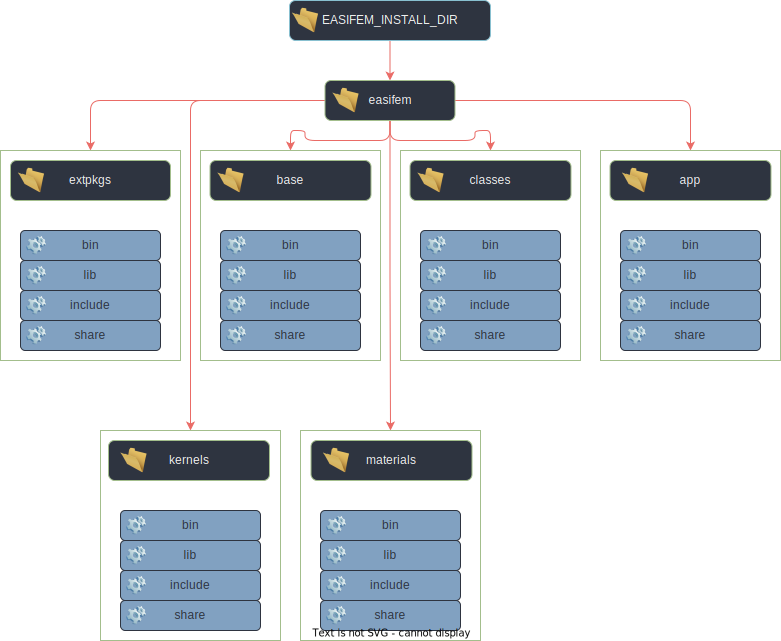

# 𑗕 Environment variables for easifem

The structure of easifem library after installation is given in Figure 1.



In this figure "EASIFEM_INSTALL_DIR" is the location of parent directory where EASIFEM will be installed.
For example, if you want to install easifem at `~/local`, then `EASIFEM_INSTALL_DIR=~/local`.

## Environment variables

| var-name | description | comment |
|:--- | :--- | :--- |
|**EASIFEM_INSTALL_DIR** | location where easifem is installed | example: `/opt`, `${HOME}`, `/usr/local/` |
| **EASIFEM_SOURCE_DIR** | location where the source code of easifem will be stored | example: `~/Dropbox`, `~/code` |
| **EASIFEM_BUILD_DIR** | location where easifem will be build | To keep your source directory clean, always keep your build directory separated from build directory |
| **EASIFEM_EXTPKGS** | location where external packages necessary for easifem are installed | It is given by `EASIFEM_INSTALL_DIR/easifem/extpkgs` |
| **EASIFEM_BASE** | location where easifemBase library is installed | It is given by: `EASIFEM_BASE=EASIFEM_INSTALL_DIR/easifem/base` |
|**EASIFEM_CLASSES** | location where easifemClasses library is installed | It is given by: `EASIFEM_INSTALL_DIR/easifem/classes` |
| **EASIFEM_MATERIALS** | location where easifemMaterials library is installed | It is given by: `EASIFEM_INSTALL_DIR/easifem/materials` |
| **EASIFEM_KERNELS** | location where easifemKernels library is installed | It is given by: `EASIFEM_INSTALL_DIR/easifem/kernels` |

## Setting up environment on UNIX and LINUX

### EASIFEM cli (recommended method)

The easiest way to work with the EASIFEM is `easifem` command line interface.

- First download the `easifem` from `pip` by using following command.

```bash
pip install easifem
```

- Then, we can set up the environment variables by using following command.

```bash
easifem setenv --install /home/easifem/install --build /home/easifem/build --source /home/easifem/src
```

- This command will create config files for bash, zsh, and fish shell in `~/.config/easifem` directory. For bash and zsh the name of the file is `easifemvar.sh`, and for fish the name of the file is `easifemvar.fish`.
- Then, you can run following command to bring the changes in your current shell session.

```bash title="bash and zsh"
source ${HOME}/.config/easifem/easifemvar.sh
```

```bash title="fish"
source $HOME/.config/easifem/easifemvar.fish
```

:::info
- If you are using bash or zsh shell, then you can place `easifemvar.sh` in your shell. For bash or zsh shell, open `.bashrc` or `.zshrc` in your editor and add the following line at the end of the file:

```bash
source ${HOME}/.config/easifem/easifemvar.sh
```

- If you are using fish shell, then you can place `easifemvar.fish` in your shell. For fish shell, open `config.fish` in your editor and add the following line at the end of the file:

```bash
source $HOME/.config/easifem/easifemvar.fish
```

:::

import Tabs from '@theme/Tabs';
import TabItem from '@theme/TabItem';

<Tabs>

<TabItem value="ee" label="𑗕 Click here to see sample of easifemvar.sh">

The following file is generated by running the command.

```bash
easifem setenv --install /home/easifem/.easifem --build /home/easifem/temp --source /home/easifem/temp/src
```

```bash
    export EASIFEM_INSTALL_DIR=/home/easifem/.easifem
    export EASIFEM_BUILD_DIR=/home/easifem/temp
    export EASIFEM_SOURCE_DIR=/home/easifem/temp/source
    export EASIFEM_BASE=/home/easifem/.easifem/easifem/base
    export LD_LIBRARY_PATH="${LD_LIBRARY_PATH}:${EASIFEM_BASE}/lib"
    export EASIFEM_CLASSES=/home/easifem/.easifem/easifem/classes
    export LD_LIBRARY_PATH="${LD_LIBRARY_PATH}:${EASIFEM_CLASSES}/lib"
    export EASIFEM_EXTPKGS=/home/easifem/.easifem/easifem/extpkgs
    export LD_LIBRARY_PATH="${LD_LIBRARY_PATH}:${EASIFEM_EXTPKGS}/lib"
    export EASIFEM_APP=/home/easifem/.easifem/easifem/app
    export LD_LIBRARY_PATH="${LD_LIBRARY_PATH}:${EASIFEM_APP}/lib"
    export EASIFEM_MATERIALS=/home/easifem/.easifem/easifem/materials
    export LD_LIBRARY_PATH="${LD_LIBRARY_PATH}:${EASIFEM_MATERIALS}/lib"
    export EASIFEM_KERNELS=/home/easifem/.easifem/easifem/kernels
    export LD_LIBRARY_PATH="${LD_LIBRARY_PATH}:${EASIFEM_KERNELS}/lib"
    export PKG_CONFIG_PATH="${PKG_CONFIG_PATH}:${EASIFEM_EXTPKGS}/lib/pkgconfig"
    export PATH="${PATH}:${EASIFEM_EXTPKGS}/bin"
    export PATH="${PATH}:${EASIFEM_APP}/bin"
```

</TabItem>

<TabItem value="fish" label="𑗕 Click here to see sample of easifemvar.fish">

The following file is generated by running the command.

```bash
easifem setenv --install /home/easifem/.easifem --build /home/easifem/temp/build --source /home/easifem/temp/src
```

```bash
set -gx EASIFEM_INSTALL_DIR /Users/easifem/.easifem
set -gx EASIFEM_BUILD_DIR /Users/easifem/temp/build
set -gx EASIFEM_SOURCE_DIR /Users/easifem/temp/src
set -gx EASIFEM_BASE /Users/easifem/.easifem/easifem/base
set -gx LD_LIBRARY_PATH $LD_LIBRARY_PATH $EASIFEM_BASE/lib
set -gx EASIFEM_CLASSES /Users/easifem/.easifem/easifem/classes
set -gx LD_LIBRARY_PATH $LD_LIBRARY_PATH $EASIFEM_CLASSES/lib
set -gx EASIFEM_EXTPKGS /Users/easifem/.easifem/easifem/extpkgs
set -gx LD_LIBRARY_PATH $LD_LIBRARY_PATH $EASIFEM_EXTPKGS/lib
set -gx EASIFEM_APP /Users/easifem/.easifem/easifem/app
set -gx LD_LIBRARY_PATH $LD_LIBRARY_PATH $EASIFEM_APP/lib
set -gx EASIFEM_MATERIALS /Users/easifem/.easifem/easifem/materials
set -gx LD_LIBRARY_PATH $LD_LIBRARY_PATH $EASIFEM_MATERIALS/lib
set -gx EASIFEM_KERNELS /Users/easifem/.easifem/easifem/kernels
set -gx LD_LIBRARY_PATH $LD_LIBRARY_PATH $EASIFEM_KERNELS/lib
set -gx PKG_CONFIG_PATH $PKG_CONFIG_PATH $EASIFEM_EXTPKGS/lib/pkgconfig
set -gx PATH $PATH $EASIFEM_EXTPKGS/bin
set -gx PATH $PATH $EASIFEM_APP/bin
```

</TabItem>

<TabItem value="close" label="↢ Hide " default>

</TabItem>
</Tabs>

### Bash, Zsh shell

If you do not want to use EASIFEM-cli, then please copy the above-mentioned template file
and place it in `.bashrc` or `.zshrc`.

### Fish shell

If you do not want to use EASIFEM-cli, then please copy the above-mentioned template file
and place it in `config.fish`.


## Setting up environment on Windows 

Coming soon.
